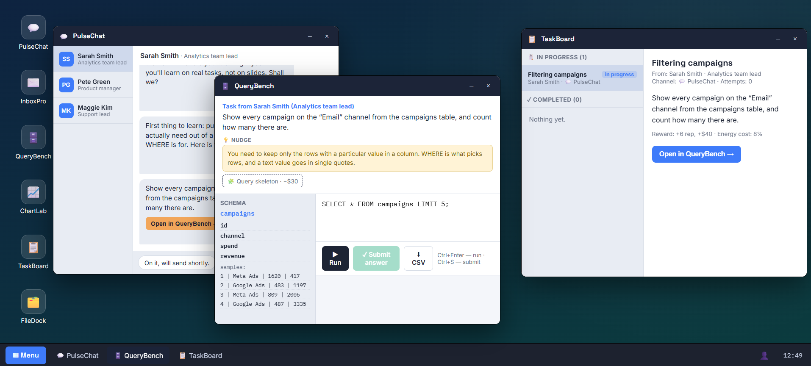

# NexOS — a data analyst job simulator

You are hired as a junior analyst at a company called DataCo. Colleagues message you on chat
and email with real requests. You answer them by writing SQL, reading the numbers, and
saying what follows from them. There is a workday, energy, a salary, and a payday.

**[▶ Play in your browser](https://solad-in.github.io/nexos-analyst-sim/)** — no install, no signup, nothing to download.
Or grab [`index.html`](https://github.com/Solad-in/nexos-analyst-sim/raw/main/index.html) and
double-click it: one self-contained file, works offline.



Available in **English and Russian** — pick the language on the start screen.

---

## Why this exists

Most SQL courses teach syntax and stop there. But almost nothing that goes wrong in an
analyst's first year is a syntax problem:

- someone asks for "conversion" and never says conversion *to what* — you compute flawlessly
  and answer the wrong question;
- the extract has the same city spelled three ways, so `GROUP BY city` quietly returns six
  cities instead of three;
- an A/B test is stopped on the day the difference first looked good;
- a correct number gets turned into a conclusion it does not support.

So this simulates the job rather than the syntax. Roughly half the tasks need no SQL at all.

## What is in it

| | |
|---|---|
| **Task types** | write a query · clarify a vague request · draw a conclusion from data · read an A/B test · find defects in an extract · choose dashboard metrics · build a chart |
| **Story** | 4 modules, 34 beats — SQL basics → working SQL → judgment → cleaning data with queries |
| **SQL engine** | written from scratch: JOIN / LEFT JOIN, GROUP BY, HAVING, subqueries, DISTINCT, LIKE, BETWEEN, IN, LOWER/UPPER/TRIM |
| **Reference** | 15 topics that unlock as the story reaches them |
| **Saves** | in your browser's localStorage. Nothing is sent anywhere — there is no network code at all |

Wrong answers get a diagnosis of *your* result — shape, grouping, aggregate — without
revealing the expected value. Correct queries can still earn a style note: `SELECT *` in a
report, an aggregate with no alias, `LIMIT` without `ORDER BY`.

## What I would like feedback on

This is the reason the repository is public. If you work with data, I would value your read
on any of these — an issue or a comment is perfect:

1. **Are the tasks realistic?** Do the requests read like something a colleague would
   actually send you?
2. **Is the difficulty curve right?** Where did it get too easy or jump too hard?
3. **What is missing?** Which part of your actual job has no equivalent here?
4. **Are the "judgment" tasks fair?** The A/B and conclusion ones have exactly one defensible
   answer by design — tell me if you disagree with any of them.
5. **Would you hand this to a junior?** If not, what stops you?

There is an [issue template](.github/ISSUE_TEMPLATE/feedback.md) with those questions.

## Honest limitations

The engine is a teaching engine written for this simulator — not PostgreSQL. The syntax it
teaches is real, but it has edges, and the app says so in its own reference section:

- no `CASE WHEN`, window functions, `UNION`, or any writes — reading only;
- no `SELECT` without `FROM`;
- no arithmetic on the left of a condition (`WHERE amount / qty > 150` will not parse);
- string functions are `LOWER`, `UPPER`, `TRIM` and nothing else;
- **text comparison ignores case**, unlike PostgreSQL. `GROUP BY` and `DISTINCT` do respect
  case, as everywhere — which is exactly why dirty data has to be normalised.

If you hit one of these, you have outgrown the simulator.

## Running and building

Nothing to install. Node is not used anywhere.

```
src/index.html   # scaffold + <script src> tags — open this one to develop
src/js/*.js      # 33 modules; load order comes from the numeric prefixes
src/styles.css
build.ps1        # concatenates src/ into the single-file index.html
index.html       # the built artifact — what this page serves and what you download
```

Open `src/index.html` straight from disk to develop: no server, no build step, it just runs.
Then `.\build.ps1` (PowerShell, no dependencies) regenerates the single file. Edit `src/`
only — the root `index.html` is overwritten on every build.

Plain `<script src>` rather than ES modules on purpose: modules are blocked under `file://`
by CORS, which would kill the double-click-to-run property. The price is a manual load order,
hence the numeric prefixes.

## Privacy

Runs entirely in your browser. No analytics, no telemetry, no network requests except the
Google Fonts stylesheet. Progress lives in `localStorage` on your device.

## Licence

[PolyForm Noncommercial 1.0.0](LICENSE.md) — free to read, learn from, fork and use for any
noncommercial purpose. Commercial use is not granted.

Required Notice: Copyright Solad-in (https://github.com/Solad-in)
